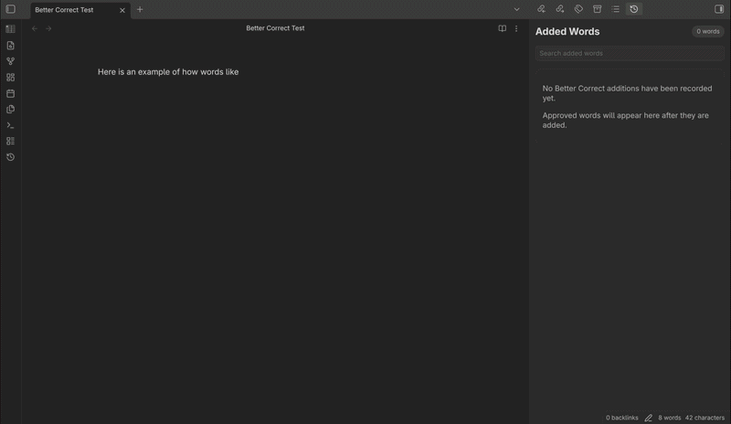
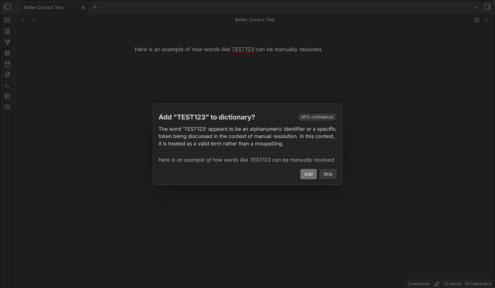

# Better Correct
*Auto add words to Obsidian dictionary.*

Something that annoys me to no end is when I have a technical word, abbreviation, or acronym marked as a misspelling by autocorrect. I then have to press like four whole buttons to add it to dictionary. I am a terrible speller so I can't just turn spellcheck off.

I decided the solution to this would be to have my GPU suck down 135 W of power for 2 seconds to fix it for me.

Whenever a word is left "misspelled" for more than 5 seconds, an LLM is used to check whether the word actually fits the surrounding context via the AI providers plugin. If the word's meaning is strongly consistent with the sentence, that is a good signal that it is probably a technical term, product name, or abbreviation rather than a typo. If the confidence is high enough, the word is auto-added to the dictionary.

## What It Does
- Watches for misspelled-looking words that stay in place for a short delay.
- Uses the AI Providers plugin to judge whether the word is actually valid in context.
- Auto-adds high-confidence words to Obsidian's native dictionary.
- Can ask before adding when the confidence is lower or when you want manual confirmation.
- Keeps a local audit log of what it added and why.

## Showcase

#### Auto add

  

#### Ask before adding

  

## Dependencies
- [AI Providers plugin](https://github.com/pfrankov/obsidian-ai-providers)

## Behavior
The plugin is intentionally biased toward technical terms, acronyms, package names, product names, class names, function names, and other domain-specific jargon. It still tries to err on the side of leaving real typos alone.

Some of the main knobs:
- Delay before AI check
- Minimum confidence threshold
- Higher confirmation threshold for true auto-add
- Acronym-only mode
- Lowercase abbreviation allowlist
- Regex allowlist and blocklist
- Capitalization-only acceptance
- Optional ask-before-adding mode

## Technical Flow
At a high level, the plugin flow is:
- The candidate detector walks the current note and extracts token-like words while skipping code fences, inline code, math spans, links, URLs, file paths, tags, emoji, and obviously suspicious punctuation.
- Candidate filtering applies the configured max length, allowlist, blocklist, acronym-only rules, and lowercase-abbreviation rules before a token is even considered.
- Each surviving token is checked against the local `nspell` dictionary first, which avoids unnecessary AI calls when the word is already known.
- If the only mismatch is capitalization and that mode is enabled, the word can be accepted immediately without involving the LLM.
- Otherwise the plugin enriches the token with local context: file path, file title, nearby text, and the containing sentence.
- That context is sent to the selected AI provider with a strict JSON-only prompt asking whether the token is genuinely misspelled and how confident it is.
- Results are cached per word plus sentence context so the same decision is not recomputed over and over during editing.
- If the AI says the token is valid and the confidence clears the configured threshold, the plugin either auto-adds it or asks for confirmation.
- Dictionary writes go through Obsidian/Electron's native spellchecker session.
- Every accepted add is recorded in the audit log with the word, context, provider, confidence, and reason so it can be reviewed later.
